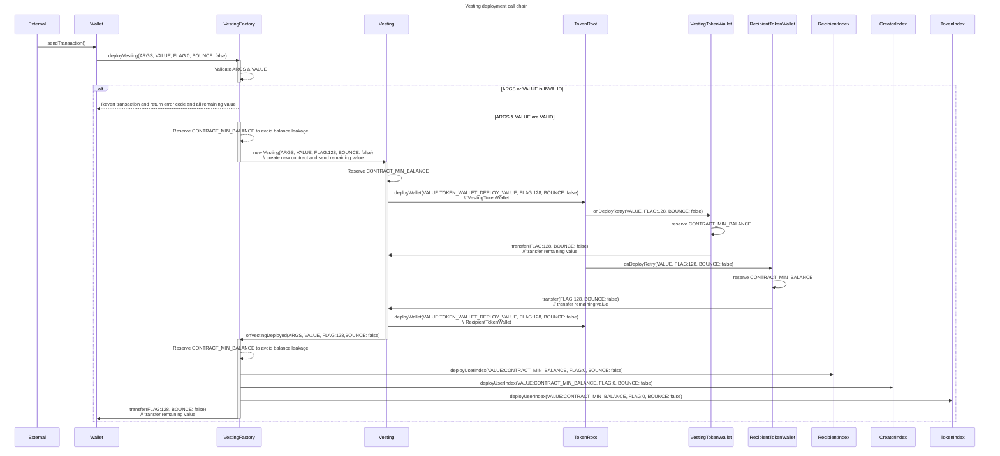
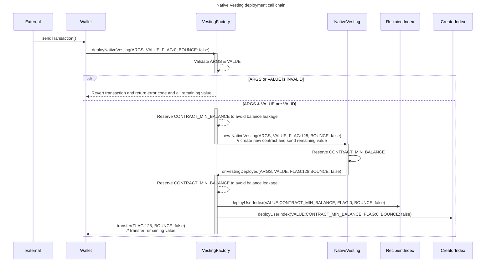

# Venom linear vesting contract

## Table of Contents

- [Venom linear vesting contract](#venom-linear-vesting-contract)
  - [Table of Contents](#table-of-contents)
  - [About](#about)
    - [Contracts](#contracts)
      - [VestingFactory](#vestingfactory)
      - [Vesting](#vesting)
    - [Call chain diagrams](#call-chain-diagrams)
      - [Vesting](#vesting-1)
      - [Native Vesting](#native-vesting)
  - [Getting Started](#getting-started)
    - [Commands](#commands)
      - [Test](#test)
      - [Deploy](#deploy)
      - [Compile](#compile)
      - [Verify](#verify)
  - [Audits](#audits)

## About

### Contracts

#### VestingFactory

Contract factory is responsible for deploying **Vesting** contracts.
Could be used by anyone. Require `user`, `token`, `remainingGasTo`, `vesting amount`, `vesting start` and `vesting end`
parameters for creating new instance of **Vesting** contract.
Emits `NewVesting` event on new contract successful deploy. Creates indexes for each vesting contract.

**VestingFactory** inherits from **IndexFactory** and deploys indexes to each Vesting contract.

Indexes are used to look up contracts for a specific creator, recipient, and token by a hash code that can be obtained off-chain. See `./script/2-indexing-example.ts` for an example of how to use indexes.

#### Vesting

Contract, that is responsible for vesting `vesting amount` of specified `tokens` for certain `user`.
Tokens are unlocked linearly every second from `vesting start` to `vesting end` and could be claimed at any time.
Vesting contract should be deposited with `vesting amount` tokens by one transfer, otherwise, a deposit will be reverted
and tokens will be sent back. Events are emitted on all actions including reverted deposit.


### Call chain diagrams

#### Vesting



#### Native Vesting



## Getting Started

### Commands

#### Test

```bash
npx locklift test --network local -t test --tests test/1-main.ts
npx locklift test --network local -t test --tests test/2-native-main.ts
npx locklift test --network local -t test --tests test/3-indexer.ts
```

#### Deploy

```bash
# network - local|testnet|mainnet
npx locklift run --network testnet --script script/1-deploy-factory.ts
```

#### Compile

```bash
npx locklift build
```

#### Verify

```bash
npx everscan-verify --api-url https://verify.venomscan.com verify -i ./ --license 'AGPL-3.0' --compiler-version bbbbeca6e6f22f9a2cd3f30021ca83aac1a1428d --linker-version 0.15.48 -I node_modules
```

## Audits

Security Assessment by [Certik](https://github.com/venom-blockchain/vesting/blob/main/audits/certik/audit.pdf)
